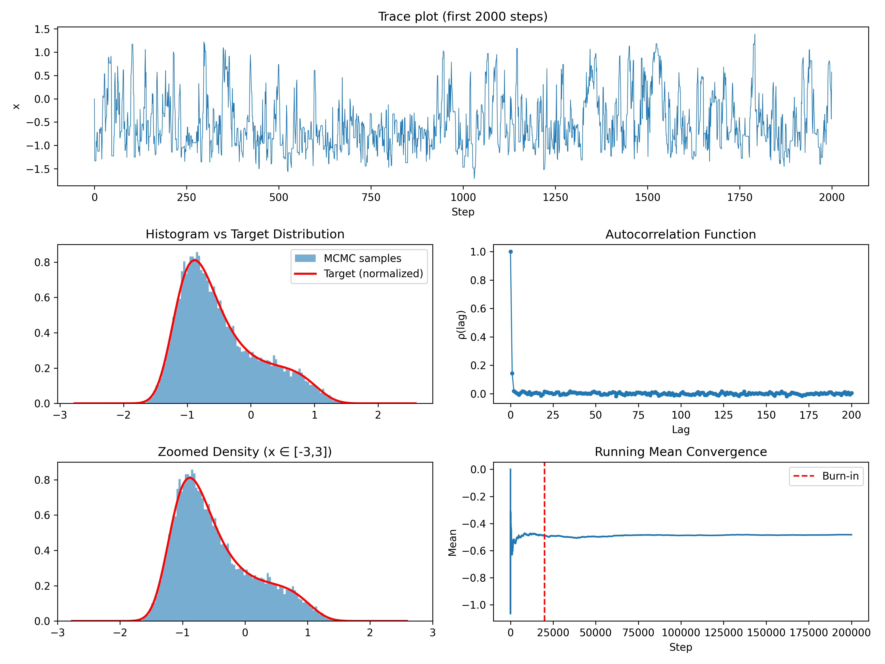

# Metropolis MCMC


Python implementation of the **Metropolis-Hastings algorithm** for 1D target distributions, with visualization and diagnostic tools.  
This repository provides a simple yet educational framework for running and analyzing MCMC simulations.

## Features

- Implements the **Metropolis-Hastings sampler** in Python.
- Supports **1D target distributions** (unnormalized).
- Includes **diagnostic tools**:
  - Acceptance rate calculation
  - Burn-in and thinning
  - Autocorrelation analysis
  - Effective Sample Size (ESS)
- **Visualizations**:
  - Trace plots
  - Histograms vs target distribution
  - Autocorrelation function
  - Running mean for convergence check
- Fully reproducible using **NumPy random generators**.

## Requirements

Install runtime dependencies with pip:

```bash
python3 -m pip install numpy matplotlib
```

## Testing

Install development dependencies with pip:

```bash
python3 -m pip install pytest
```

Run the test suite with:

```bash
PYTHONPATH=. pytest
```

## Usage

1. Clone the repository:

```bash
git clone https://github.com/giuls-quantum/metropolis-mcmc.git
cd metropolis-mcmc
```

2. Run the CLI:

```bash
python3 -m src.mcmc_1d.cli
```

The CLI will:

- Run the Metropolis sampler for the configured number of steps.
- Print acceptance rate, posterior mean, standard deviation, and effective sample size.
- Generate plots for trace, histogram, autocorrelation, and running mean.
- Save the summary plot as `mcmc_plots.png` by default.

### CLI options

```bash
python3 -m src.mcmc_1d.cli \
  --n_steps 200000 \
  --sigma 0.6 \
  --seed 2025 \
  --burn-in 20000 \
  --thin 10 \
  --output mcmc_plots.png \
  --show
```

- `--n_steps`: number of MCMC steps
- `--sigma`: proposal standard deviation
- `--seed`: random seed for reproducibility
- `--burn-in`: number of initial samples to discard
- `--thin`: thinning factor applied after burn-in
- `--output`: path where the summary plot is saved
- `--show`: open the plot window after saving

## Example Plot

Here is an example of the output generated by the 1D Metropolis sampler:



## Project structure

- `src/mcmc_1d/sampler.py`: Metropolis-Hastings implementation
- `src/mcmc_1d/targets.py`: target density and log-target functions
- `src/mcmc_1d/diagnostics.py`: autocorrelation, IAT, ESS, and diagnostic summaries
- `src/mcmc_1d/plotting.py`: reusable plotting helpers
- `src/mcmc_1d/experiment.py`: orchestration for a single experiment
- `src/mcmc_1d/cli.py`: entry point for running the full workflow from the command line

## Notes

- The code is designed for **educational and research purposes**, and can be extended to higher dimensions or other MCMC algorithms.

## License

This project is licensed under the MIT License – see the [LICENSE](LICENSE) file for details.

## References

- Metropolis, N., et al. (1953). *Equation of State Calculations by Fast Computing Machines*. Journal of Chemical Physics.  
- Hastings, W.K. (1970). *Monte Carlo Sampling Methods Using Markov Chains and Their Applications*. Biometrika.
